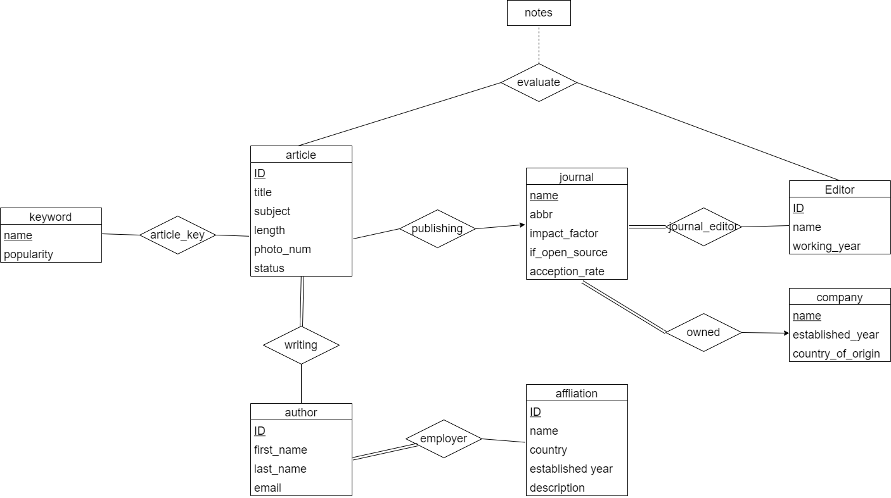

# Publication management system
This is a Database Driven Web App. The project is to create a web interface to the psql database using Python's bottle framework. 

## Required package

```
pip3 install bottle
pip3 install psycopg2-binary
```
Run the code locally

```
python3 final.py
```

Then visit: http://localhost:53001/

## E/R diagram


## Functionality
function (0):  title uses wildcard search.  We can search any combination of Title, ID, Subject.

Eg: 
```
search  Title: rj    ID: 3     return "No valid result is found!"
search Title: rj               return one article
No input                       return the whole list of articles
```


function (5): after insert an author to the given article, 
the return page will show whether the author already exists or new author will be inserted into the author table.
In either case, the writing relation between author and artcle will be updated.

Eg:  Add a new author to Article 1.

Input:

```
First Name: Suzanne
Last Name: Mitchell
The author is already in table author.
```

Return : 
```
Author Suzanne Mitchell is in the original author table; 
Author-List of Article 1 is updated
```

Input:

```
First Name:sdg
Last Name: bgf
The author is new.
```

Return: 

```
Author sdg bgf is inserted into author table; 
Author-List of Article 1 is updated
```
